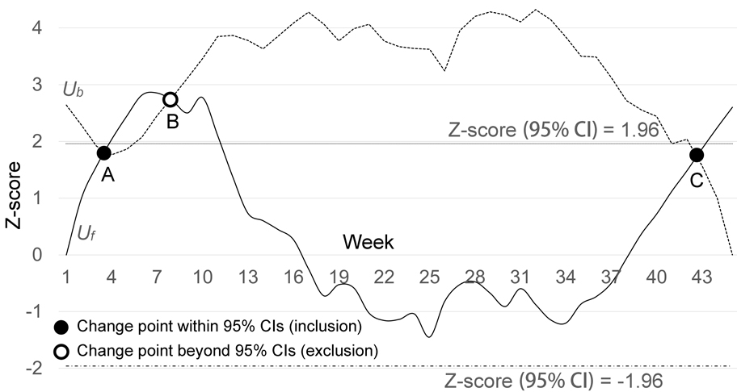

# A modified MKS test for COVID-19 change point detection

## Introduction
The nonparametric Mann-Kendall-Sneyers (MKS) test, oftentimes called the sequential MKS test, has been applied to the change point detection for long-term time series data (e.g., hydrological changes, climatic changes). According to the Centers for Disease Control and Prevention (CDC), both social distancing and mass gathering can potentially lead to an abrupt change in regional COVID-19 cases, albeit in different directions. Then, we have evaluated the potential of the MKS test for change point detection in short-term time series data, the COVID-19 cases of infection. 

## Data description
The [dataset](Data.xlsx) used for the analysis is the COVID-19 time series data in all 50 US states. The state-level case data were derived from the [USAFacts](https://usafacts.org/data/) with the coverage from March 23, 2020 through January 31, 2021 in a total of 45 weeks. The data were aggregated on a weekly basis for each state, generating new weekly cases as the time series *X*.

The [dataset](Data.xlsx) includes varaibles derived by the MKS test. The variables include *Case, Mi, Sk, E(Sk), VAR(Sk), R_case, R_Mi, R_Sk, R_Uf, and U_b*. The [dataset](Data.xlsx) also includes the final plots with the forward sequence *U_f* and the backward sequence *U_b* for each state.

### Data columns
- *Week*: week ID, where Week 1 starts on March 23, 2020 and Week 45 ends on January 31, 2021.
- *Case*: new weekly cases in the time series *X*.
- *Mi*: cumulative times that the case value of the current week is larger than that of each preceding week.
- *Sk*: test statistics of *X*.
- *E(Sk)*: mean of *Sk*.
- *VAR(Sk)*: variance of *Sk*.
- *U_f*: forward sequence of *X*.
- *R_case*: reversed time series *X* (*Xr*).
- *R_Mi*: *Mi* of *R_case*.
- *R_Sk*: *Sk* of the reversed time series *X* (*Xr*).
- *R_Uf*: Intermediate sequence (*U_fr*) derived from the reversed time series *X* (*Xr*).
- *U_b*: backward sequence of *X*.

### Step-to-step implementation in [data](Data.xlsx)
1. D2, E2, F2, G2, H2, J2, K2, L2 = 0.
2. P1 = A46.
3. I2 = INDIRECT(“C”&P$1-A2+2).
4. Apply the INDIRECT function to all rows from I2 to I46.
5. D3 = COUNTIF (C$2:C2,”<”&C3), then apply the same function to the rest of the column.
6. E3 = E2+D3, then apply the same function to the rest of the column.
7. F3 = A3*(A3-1)*(2*A3+5)/72, then apply the same function to the rest of the column.
8. H3=(E3-F3)/SQRT(G3), then apply the same function to the rest of the column.
9. J3 = COUNTIF (I$2:I2,”<”&I3), then apply the same function to the rest of the column.
10. K3 = K2+J3, then apply the same function to the rest of the column.
11. L3 = (K3-F3)/SQRT(G3), then apply the same function to the rest of the column.
12. M2 = -INDIRECT(“L”&P$1-A2+2), then apply the same function to the rest of the column.
13. Q2 = 1.96 (positive z-score for the upper 95% CI), then apply the same function to the rest of the column.
14. R2 = -1.96 (negative z-score for the lower 95% CI, then apply the same function to the rest of the column.
15. Plot U_f, U_b, and y = ±1.96 (95% CIs) in a diagram for each state.

## Results and example
The figure below shows the MKS test result for Virginia with the forward sequence (solid line) and the backward sequence (dashed line). The black dot is the identified change point, and the white dot is the excluded change point.

The figure below shows the detected change points withint the 95% CIs for all states (*n* = 32).

